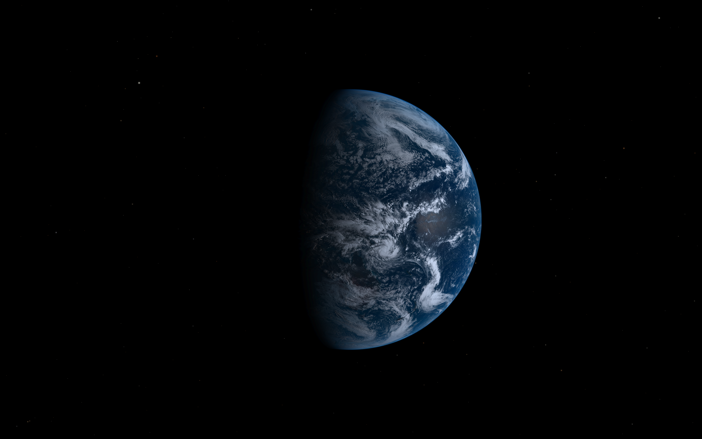

# Live Earth Wallpaper

A native Windows application that displays live Himawari-8 satellite imagery of Earth with an accurate star field as your desktop wallpaper.



## Features

- **Live Earth imagery** from the Himawari-8 geostationary satellite (140.7°E)
- **Accurate star field** based on HYG (Hipparcos-Yale-Gliese) catalog with 8,921 stars
- **Planet positions** calculated using NASA JPL orbital elements
- **Moon phase and position** with realistic illumination
- **Multi-monitor support** with two modes:
  - **Span**: Single continuous view across all monitors
  - **Duplicate**: Each monitor gets its own centered Earth view
- **High-DPI aware** - renders at native resolution on scaled displays
- **Offline fallback** - uses cached imagery (shown in grayscale) when network unavailable
- **System tray** - minimal UI with refresh, mode toggle, and startup options
- **Lightweight** - ~6MB executable, ~15-30MB memory footprint

## Requirements

- Windows 10 (1703+) or Windows 11
- Internet connection for satellite imagery updates

## Installation

### From Release

Download the latest `live-earth-wallpaper.exe` from [Releases](https://github.com/JoshuaCHolmes/live-earth-wallpaper/releases) and run it.

### From Source

```bash
git clone https://github.com/JoshuaCHolmes/live-earth-wallpaper.git
cd live-earth-wallpaper
cargo build --release
./target/release/live-earth-wallpaper.exe
```

## Usage

Run the application and it will:

1. Create a system tray icon
2. Detect your monitor configuration
3. Fetch the latest Himawari-8 satellite image
4. Render the star field, planets, and moon for the current time
5. Set the composite as your desktop wallpaper
6. Update every 10 minutes

### System Tray Menu

| Option | Description |
|--------|-------------|
| **Refresh Now** | Immediately fetch new imagery and update wallpaper |
| **Mode: Span/Duplicate** | Toggle between multi-monitor modes |
| **Run on Startup** | Toggle automatic startup with Windows |
| **Exit** | Close the application |

### Command Line Flags

```bash
# Normal operation (runs in tray)
live-earth-wallpaper.exe

# Single update and exit (useful for testing or Task Scheduler)
live-earth-wallpaper.exe --update-once

# Use duplicate mode (Earth centered on each monitor)
live-earth-wallpaper.exe --duplicate

# Combine flags
live-earth-wallpaper.exe --update-once --duplicate
```

## How It Works

### Field of View

The wallpaper simulates the view from Himawari-8's position in geostationary orbit at 140.7°E longitude, 35,793 km above Earth. From this vantage point, Earth subtends ~17.4° of the sky. The star field, planets, and moon are positioned at their correct angular distances based on real astronomical calculations.

### Offline Mode

If the satellite imagery cannot be fetched (no internet, server issues), the application falls back to a cached image. **Cached images are displayed in grayscale** to visually indicate that the view is not live.

### Multi-Monitor Modes

- **Span** (default): Creates a single continuous star field spanning all monitors, with Earth centered on the virtual desktop. Best for immersive setups.
- **Duplicate**: Each monitor gets an independent view with Earth centered. Useful for mismatched monitor sizes or presentations.

## Technical Details

### Data Sources

| Data | Source |
|------|--------|
| Earth imagery | [NICT Himawari-8](https://himawari8.nict.go.jp/) (10-minute updates) |
| Star catalog | [HYG Database v4.1](https://github.com/astronexus/HYG-Database) (mag ≤ 6.5) |
| Planet positions | [NASA JPL](https://ssd.jpl.nasa.gov/planets/approx_pos.html) orbital elements |
| Moon position | Meeus lunar theory |

### Defaults

| Setting | Value |
|---------|-------|
| Update interval | 10 minutes |
| Earth image resolution | 4×4 tiles (2200×2200 px) |
| Star magnitude limit | 6.5 (naked eye visibility) |
| Earth screen coverage | 60% of viewport height |

## Development

### Building on Windows

Requires Visual Studio Build Tools with C++ workload:

```bash
cargo build --release
```

### Cross-Compiling from Linux/WSL

```bash
# Using mingw-w64 (NixOS example)
nix-shell -p pkgsCross.mingwW64.stdenv.cc rustup
rustup target add x86_64-pc-windows-gnu
cargo build --release --target x86_64-pc-windows-gnu
```

## Credits

- Original concept: [Live-Space-View](https://github.com/JoshuaCHolmes/Live-Space-View) (Wallpaper Engine)
- Satellite imagery: [NICT Science Cloud / Himawari-8](https://himawari8.nict.go.jp/)
- Star data: [HYG Database](https://github.com/astronexus/HYG-Database) by David Nash
- Orbital elements: [NASA JPL Solar System Dynamics](https://ssd.jpl.nasa.gov/)

## License

MIT License - see [LICENSE](LICENSE) for details.
